 

VegaVortex Digital is a creative digital agency working with clients internationally. We design and build websites, interfaces, and software, with web development at the core.

### What we do

| Service | What it covers |
|---|---|
| **Web development** | Custom websites, CMS platforms, and full-stack web applications, built to be fast and easy to maintain. |
| **Design** | Interfaces, brand visuals, and motion, designed for the web first. |
| **Software** | Custom tools, integrations, and automation, with AI where it genuinely helps. |
| **Search & growth** | Technical SEO, Google Ads, and analytics, so the right people find what we build. |

### How we work

- **One team, start to finish.** Design, development, and growth are handled together, so nothing gets lost between handoffs.
- **Scoped to what you need.** A focused project, or ongoing care for your site and online presence.
- **Built to last.** Proven tools and clean code, so what we build stays easy to update after launch.

### Work with us

[vegavortex.com](https://vegavortex.com) · [info@vegavortex.com](mailto:info@vegavortex.com) · [LinkedIn](https://www.linkedin.com/company/vegavortexdigital)
